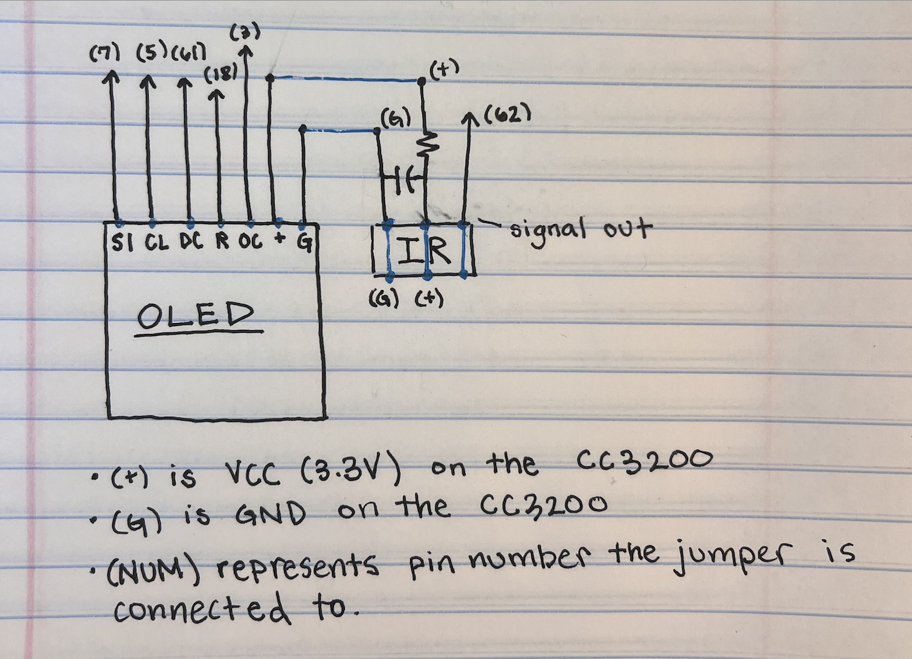
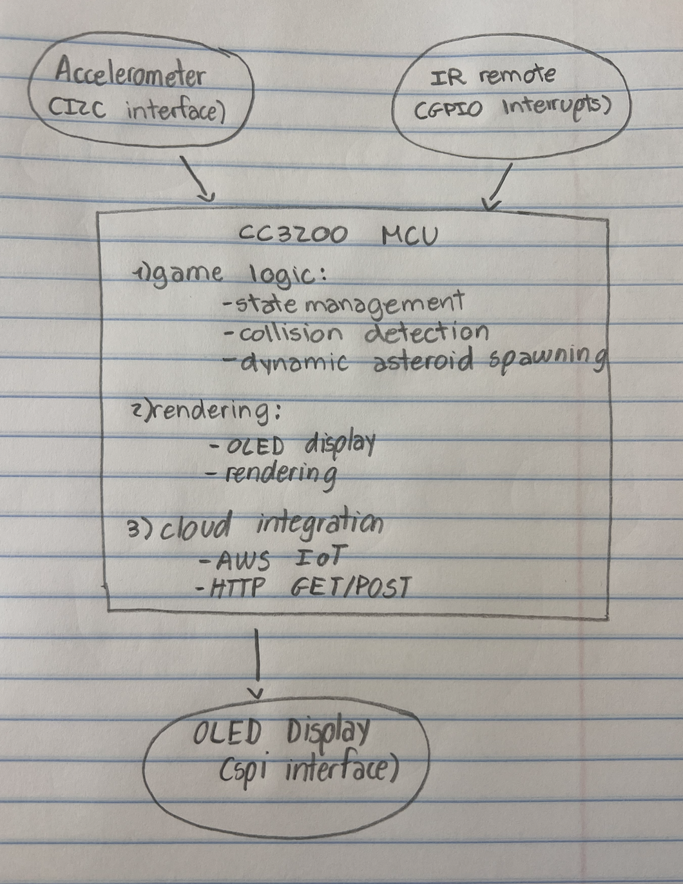
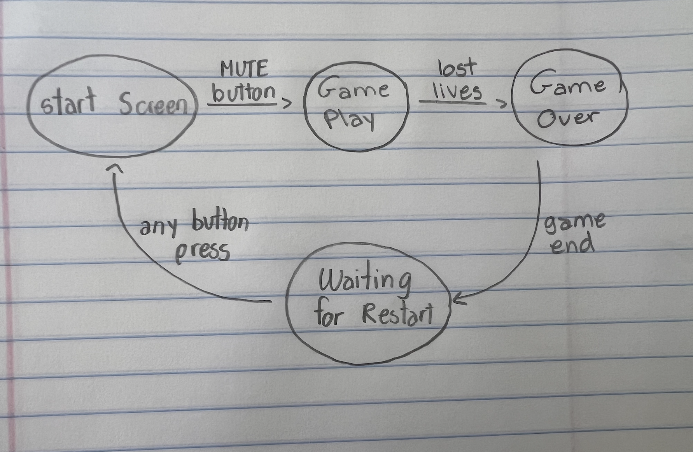

# 🚀 Asteroid Avoidance Game

A real-time embedded systems survival game built on the CC3200 microcontroller, featuring accelerometer-based controls, dynamic difficulty scaling, and cloud-connected high score tracking via AWS IoT.

[

## 📋 Table of Contents

- [Overview](#overview)
- [Features](#features)
- [Hardware Components](#hardware-components)
- [Source Code Structure](#source-code-structure)
- [Getting Started](#getting-started)
- [Game Controls](#game-controls)
- [Architecture](#architecture)
- [Implementation Details](#implementation-details)
- [Challenges & Solutions](#challenges--solutions)
- [Future Enhancements](#future-enhancements)
- [Documentation](#documentation)
- [Contributors](#contributors)

## 🎯 Overview

Asteroid Avoider is a survival game implemented in C for the CC3200 microcontroller platform. Players control a spaceship using accelerometer tilt controls to dodge dynamically spawning asteroids. The game features a sophisticated scoring system with milestone-based difficulty scaling and cloud-synchronized high scores via AWS IoT Core.

### Key Technical Achievements
- **Real-time 45 FPS gameplay** with optimized C implementation
- **Advanced accelerometer integration** with MMA8452Q sensor (I2C address 0x18)
- **Dynamic asteroid spawning system** with slot-based positioning and collision avoidance
- **IR NEC protocol decoder** with interrupt-driven pulse width measurement
- **AWS IoT Core integration** with TLS encryption and JSON messaging
- **Finite State Machine** game architecture with efficient rendering

## ✨ Features

### 🎮 Core Gameplay
- **Accelerometer Ship Control**: Tilt-based left/right movement with configurable deadzone
- **Dynamic Asteroid System**: 4 speed tiers (1-4 pixels/frame) with radius 6-12 pixels
- **Score-Based Difficulty**: Milestone system (100, 1000, 10000 points) triggers additional asteroids
- **Lives System**: 3 lives with collision detection using bounding box algorithms
- **Slot-Based Spawning**: 5 screen-divided slots prevent asteroid clustering

### 📺 Input & Control
- **IR Remote (NEC Protocol)**: MUTE to start, any button to restart
- **Interrupt-Driven Decoding**: SysTick-based pulse width measurement
- **Multi-State Input Handling**: Context-sensitive button responses

### 🌐 Cloud Integration
- **AWS IoT Core**: Secure MQTT over TLS connection
- **High Score Sync**: Automatic GET/POST operations for leaderboard
- **Device Authentication**: Certificate-based security with device shadows
- **JSON Messaging**: Structured data exchange with cloud backend

### 🖥️ Graphics & Display
- **128x128 RGB OLED**: Adafruit SSD1351 with SPI interface
- **Efficient Rendering**: Buffered graphics with selective screen updates
- **Custom Graphics Library**: Adapted Adafruit GFX for embedded optimization
- **Real-time UI**: Score, lives, and game state overlays

## 🔧 Hardware Components

| Component | Model | Interface | Purpose | I2C Address |
|-----------|-------|-----------|---------|-------------|
| **Microcontroller** | CC3200-LAUNCHXL | - | Main processing unit | - |
| **Display** | Adafruit 1431 OLED | SPI | 128x128 RGB game graphics | - |
| **Accelerometer** | MMA8452Q | I2C | Tilt-based spaceship control | 0x18 |
| **IR Receiver** | Vishay TSOP31130 | GPIO | Remote control input | - |
| **Remote Control** | ATT-RC1534801 | IR NEC Protocol | Game navigation | - |
| **Capacitor** | 10µF Electrolytic | - | DC filtering for IR receiver | - |

### Circuit Connections


### Complete System Diagram


## 📁 Source Code Structure

```
asteroid-avoidance/
├── main.c                  # Main game engine (1537 lines)
├── Adafruit_GFX.c/.h      # Graphics library adaptation
├── Adafruit_OLED.c        # OLED display driver
├── Adafruit_SSD1351.h     # SSD1351 OLED controller
├── oled_test.c/.h         # Display testing utilities
├── i2c_if.c               # I2C interface for accelerometer
├── gpio_if.c              # GPIO interface for IR receiver
├── timer_if.c             # Timer interface for frame rate control
├── uart_if.c              # UART interface for debugging
├── network_common.c       # Network utilities for AWS IoT
├── pin_mux_config.c/.h    # Pin multiplexing configuration
├── glcdfont.h             # Font definitions for text rendering
└── utils/
    └── network_utils.c/.h # Network utility functions
```

### Key Code Modules

#### Game Engine (`main.c`)
- **Game State Machine**: 4 states (Start, Playing, Game Over, Waiting Restart)
- **Asteroid System**: Dynamic spawning with 5-slot positioning algorithm
- **Collision Detection**: Bounding box collision checking
- **Frame Rate Control**: 45 FPS timing with SysTick timer
- **Score Milestones**: Progressive difficulty at 100, 1000, 10000+ points

#### Graphics System
- **Adafruit GFX Library**: Adapted for CC3200 embedded environment
- **SPI Communication**: 20MHz SPI interface to OLED display
- **Efficient Rendering**: Selective screen updates to maintain frame rate
- **Color Definitions**: 16-bit RGB color palette

#### Input Systems
- **IR Decoder**: NEC protocol with pulse width measurement
- **Accelerometer Interface**: I2C communication with deadzone filtering
- **Interrupt Handling**: GPIO interrupts for IR and SysTick for timing

## 🚀 Getting Started

### Prerequisites
- CC3200 LaunchPad development board
- Code Composer Studio (CCS) IDE
- AWS IoT Core account and certificates
- All hardware components listed above

### Setup Instructions

1. **Hardware Assembly**
   - Connect components according to the circuit diagram
   - Ensure proper power supply (3.3V) for all components
   - Add pull-up resistors for I2C communication

2. **Software Setup**
   - Clone this repository
   - Import the project into Code Composer Studio
   - Configure AWS IoT certificates in the flash memory
   - Set up WiFi credentials for cloud connectivity

3. **AWS IoT Configuration**
   - Create an IoT Thing in AWS IoT Core
   - Generate and download certificates
   - Create MQTT topic: `asteroidAvoider/highscore`
   - Configure appropriate policies for read/write access

4. **Compilation & Deployment**
   - Build the project in CCS
   - Flash the firmware to the CC3200
   - Verify all hardware connections are working

## 🎮 Game Controls

| Control | Action |
|---------|--------|
| **Tilt Left** | Move spaceship left |
| **Tilt Right** | Move spaceship right |
| **IR Remote - Mute** | Start new game |
| **IR Remote - Any Button** | Restart after game over |

### Game Mechanics
- **Lives**: Start with 3 lives, lose one per collision
- **Scoring**: Points awarded for surviving; larger/faster asteroids = more points
- **Difficulty**: Asteroid speed and spawn rate increase with score
- **High Score**: Automatically synced with AWS IoT cloud storage

## 🏗️ Architecture

### System Overview
```
┌─────────────────┐    ┌──────────────────┐    ┌─────────────────┐
│   Input Layer   │    │  Processing Unit │    │  Output Layer   │
│                 │    │                  │    │                 │
│ • Accelerometer │───▶│    CC3200 MCU    │───▶│  OLED Display   │
│ • IR Remote     │    │  • Game Logic    │    │  • Game Graphics│
└─────────────────┘    │  • FSM Control   │    │  • Score/Lives  │
                       │  • Cloud Comms   │    └─────────────────┘
                       └──────────┬───────┘
                                  │
                            ┌─────▼─────┐
                            │  AWS IoT  │
                            │   Cloud   │
                            └───────────┘
```



### Finite State Machine
1. **Start Screen**: Display instructions and current high score
2. **Gameplay**: Active game loop with collision detection and rendering
3. **Game Over**: Show final score and upload new high scores
4. **Restart**: Wait for input to return to start screen

## 💻 Implementation Details

### Core Modules

#### Accelerometer Interface (I2C)
- **Hardware**: MMA8452Q sensor at I2C address 0x18
- **Sampling**: Every 2 frames to reduce I2C overhead while maintaining responsiveness
- **Processing**: X-axis acceleration mapped to spaceship movement with deadzone filtering
- **Configuration**: 50Hz data rate in active mode with standby initialization sequence
- **Deadzone**: ±3 units to reduce jitter and improve balance
- **Movement Speed**: Clamped to ±2 pixels/frame for smooth gameplay

```c
// Accelerometer movement with deadzone
const int deadzone = 3;
if (x_speed_calc > -deadzone && x_speed_calc < deadzone) {
    x_speed_calc = 0;
}
x_speed = -1 * x_speed_calc; // Invert for intuitive tilt control
```

#### IR Remote Control (GPIO Interrupt)
- **Protocol**: NEC IR protocol with 32-bit command sequences
- **Processing**: SysTick-based pulse width measurement (400-600µs short, 1500-1700µs long)
- **Interrupt**: Rising/falling edge GPIO interrupt service routine
- **Button Mapping**: 12 buttons with lookup table for sequence matching
- **Game Control**: MUTE button starts game, any button restarts from game over

```c
// IR pulse decoding with timing thresholds
#define SHORT_PULSE_MIN 400
#define SHORT_PULSE_MAX 600
#define LONG_PULSE_MIN  1500
#define LONG_PULSE_MAX  1700
```

#### OLED Graphics (SPI)
- **Controller**: Adafruit SSD1351 with 128x128 RGB display
- **Interface**: 20MHz SPI communication with hardware acceleration
- **Rendering**: Custom `printOLED()` function using adapted Adafruit GFX library
- **Performance**: Selective screen updates and efficient object erasure for 45 FPS
- **Color Palette**: 16-bit RGB color definitions (WHITE, RED, GREEN, etc.)

#### Asteroid System
- **Spawning Algorithm**: 5-slot system divides screen width to prevent clustering
- **Speed Tiers**: 4 fixed speeds (1-4 pixels/frame) for consistent gameplay
- **Size Variation**: Radius ranges from 6-12 pixels with random selection
- **Collision Detection**: Bounding box algorithm with center-to-center distance calculation
- **Milestone Spawning**: Additional asteroids at score thresholds (100, 1000, 10000+)

```c
// Asteroid spawning with slot-based positioning
#define MAX_ASTEROIDS 5
#define NUM_ASTEROID_SLOTS 5
int asteroid_slot_x[NUM_ASTEROID_SLOTS]; // Pre-calculated X positions
```

#### AWS IoT Integration (WiFi/MQTT)
- **Server**: AWS IoT Core endpoint (us-east-2 region)
- **Security**: TLS encryption with device certificates and private keys
- **Protocol**: HTTP over TLS (port 8443) for device shadow updates
- **Topics**: Device shadow for high score persistence
- **Operations**: GET current high score on startup, POST new records when achieved
- **JSON Format**: Structured device shadow state with "desired" high score field

```c
// AWS IoT JSON message structure
"{"
"\"state\": {"
    "\"desired\" : {"
        "\"highscore\" : \"%s\""
    "}"
"}"
"}"
```

#### Game State Machine
1. **START_SCREEN**: Display instructions and AWS-fetched high score
2. **PLAYING**: Active gameplay with collision detection and rendering loop
3. **GAME_OVER**: Final score display and high score comparison/upload
4. **WAITING_RESTART**: Await any IR button press to return to start

#### Frame Rate Control
- **Target**: 45 FPS for smooth embedded gameplay
- **Implementation**: SysTick timer with calculated frame delay
- **Timing**: `FRAME_DELAY_TICKS = SYSCLKFREQ / TARGET_FPS`
- **Optimization**: Efficient rendering and selective screen updates

## 🧩 Challenges & Solutions

### Integration Complexity
**Challenge**: Merging multiple lab components (IR control + AWS IoT) into cohesive system
**Solution**: Modular design approach with clear interfaces between components

### AWS IoT Debugging
**Challenge**: TLS setup, JSON formatting, and connection stability
**Solution**: Comprehensive logging, AWS documentation study, and iterative testing

### Real-time Performance
**Challenge**: Maintaining 45 FPS with multiple hardware interfaces
**Solution**: Optimized polling cycles, buffered graphics, and interrupt-driven input

### Hardware Conflicts
**Challenge**: Pin conflicts and timing issues between multiple peripherals
**Solution**: Careful pin mapping and priority-based interrupt handling

## 🔮 Future Enhancements

- 🏆 **Global Leaderboard**: Multiple player scores with rankings
- 🔊 **Audio System**: Sound effects and background music
- 🎨 **Enhanced Graphics**: Sprite animations and particle effects
- ⚙️ **Calibration Menu**: User-customizable accelerometer sensitivity
- 📱 **Mobile App**: Companion app for remote score viewing
- 🌟 **Power-ups**: Special abilities and bonus items
- 🔄 **Double Buffering**: Eliminate remaining graphics flickering

## 📚 Documentation

### 🌐 Live Documentation
Visit the live project site: **[Asteroid Avoidance Game Documentation](https://your-username.github.io/asteroid-avoidance/)**

### Build Documentation Locally
This project uses a Makefile-based documentation system to generate HTML reports from Markdown source files.

```bash
# Install dependencies (Ubuntu/Debian)
sudo apt-get install pandoc

# Generate HTML documentation
make all

# Build with deployment info
make deploy-docs

# Clean generated files
make clean

# Show available commands
make help
```

### 🚀 Deployment to GitHub Pages

This repository is configured for automatic deployment:

1. **Setup Repository**:
   - Push this code to a GitHub repository
   - Go to Settings → Pages
   - Set source to "GitHub Actions"

2. **Automatic Deployment**:
   - Every push to `main` branch triggers a build
   - GitHub Actions runs `make all` and deploys the site
   - Documentation becomes available at `https://username.github.io/repository-name/`

3. **Local Preview**:
   - Run `make all` to generate `README.html`
   - Open in browser to preview before deployment

### Repository Structure
```
asteroid-avoidance/
├── asteroid-avoidance/      # Complete C source code
├── assets/                  # Images, videos, styling
├── .github/workflows/       # GitHub Actions for deployment
├── README.md               # Main documentation (this file)
├── index.html              # Generated documentation website
├── Makefile                # Documentation build system
└── DEPLOYMENT.md           # Deployment guide
```

### View Full Report
Open `index.html` in your browser to view the complete project documentation with embedded media and detailed technical specifications.

## 👥 Contributors

**Marina Mata** - [mmbmata@ucdavis.edu](mailto:mmbmata@ucdavis.edu)  
**Austin (Zoey) Vo** - [ausvo@ucdavis.edu](mailto:ausvo@ucdavis.edu)

*UC Davis College of Engineering*  
*EEC 172 - Embedded Systems Course*

---

### 📄 License
This project was developed as part of the EEC 172 coursework at UC Davis. All hardware components were provided by the course.

---
*Built with ❤️ for embedded systems and real-time gaming*
